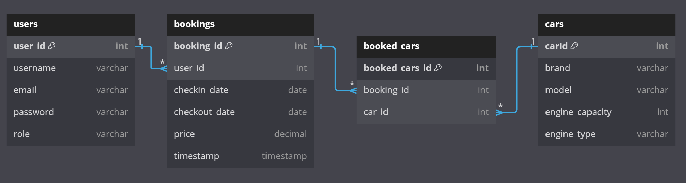

# Rent-A-Car REST API Project

#### Student: Sandu Eduard Alexandru

#### Grupa: 334

## Descrierea aplicatiei

Acest REST API a fost conceput pentru a servi ca backend pentru un website de inchiriat masini. Astfel, utilizatorii pot vizualiza masinile puse la dispozitie pentru inchiriere, ce vor fi filtrate in functie de disponibilitatea pentru un interval exact de timp (spre exemplu, vrem sa inchiriem o masina in intervalul 23.05.2024-25.05.2024)

Utilizatorii sunt nevoiti sa se inregistreze si sa se autentifice pentru a putea sa efectueze o rezervare - acestia beneficiaza de istoricul propriu de rezervari si sa inchirieze doar masini disponibile care nu sunt inchiriate de altcineva.

Vor exista 2 roluri pentru utilizatori: **Admin** si **User**

Am folosit o baza de date *MySQL* pentru a stoca datele si *Sequelize* pentru ORM. Pentru a vizualiza si documenta rutele din cadrul proiectului am folosit *Swagger*.

## Setup 

Instalarea pachetelor prezente in `package.json` este necesara intrucat am inclus folderul `node_modules` in `.gitignore`

```
npm install 
```

Pentru a porni aplicatia am inclus un shortcut pentru nodemon:

```
npm start
```

Serverul va porni pe `localhost:3001`, iar pe ruta `/api-docs` vom seta swagger astfel incat sa preia toate rutele din folderul routes

In fisierul `.env` avem environment variables - de regula, secret keys si user authentication data pentru baza de date, fisier adaugat si el in `.gitignore`

```JS
JWT_SECRET=DKJEHFGEHJGF43RUIEHFBH3YUYRFB3UR3U38Y4
DB_USER=root
DB_PASSWORD=12345678
```

## Structura bazei de date



Pentru a asigura fluxul dorit al aplicatiei am inclus 3 entitati si o tabela de intersectie pentru relatia M:M

- Entitatea **users** ce retine date despre utilizatori
- Entitatea **bookings** ce retine detaliile primordiale despre inchirierile facute
- Entitatea **cars** unde avem stocate masinile pe care le putem inchiria
- Tabela **booked_cars** rezolva relatia M:M dintre **bookings** si **cars**, rezultand 2 relatii 1:M
- Intre tabelele **users** si **bookings** avem inca un 1:M intrucat toate rezervarile sunt facute de un user

## Componenta proiectului 

### Fisierul server.js si routers

La pornirea aplicatiei folosind `npm start`, se va initializa fisierul server.js care va initia Swagger si va realiza conexiunea cu baza de date

Am grupat rutele in functie de entitatile de care fac referire pentru a crea cate un router.

```JS
const app = express();

// Routes
const userRoutes = require("./routes/userRoutes");
app.use("/api/users", userRoutes);

const authRoutes = require("./routes/authRoutes");
app.use("/api/auth", authRoutes);

const carRoutes = require("./routes/carRoutes");
app.use("/api/cars", carRoutes);

const bookedCarRoutes = require("./routes/bookedCarRoutes");
app.use("/api/booked-cars", bookedCarRoutes);

const bookingRoutes = require("./routes/bookingRoutes");
app.use("/api/bookings", bookingRoutes);
```

Fiecare dintre aceste routere contin toate operatiile CRUD necesare (si toate verbele `GET`, `POST`, `PUT`, `DELETE`) pentru a gestiona inregistrarile din fiecare tabela mentionata.

### ORM Models

Pentru a sincroniza relatiile dintre tabelele din baza de date cu modelul ORM, in folderul *models* avem fisierul `index.js` unde am descris relatiile dintre entitati

```JS
const User = require("./user");
const Booking = require("./booking");
const Car = require("./car");
const BookedCar = require("./booked_cars");

User.hasMany(Booking, { foreignKey: "user_id" });
Booking.belongsTo(User, { foreignKey: "user_id" });

Booking.belongsToMany(Car, { through: BookedCar, foreignKey: "booking_id" });
Car.belongsToMany(Booking, { through: BookedCar, foreignKey: "car_id" });

Booking.hasMany(BookedCar, { foreignKey: "booking_id" });
Car.hasMany(BookedCar, { foreignKey: "car_id" });

BookedCar.belongsTo(Booking, { foreignKey: "booking_id" });
BookedCar.belongsTo(Car, { foreignKey: "car_id" });
```

### Autentificare & Inregistrare

Pentru a crea un cont, folosim ruta `/api/users` din `userRoutes.js`.
Aceasta ruta va hashui parola si o va adauga impreuna cu username-ul si email-ul (daca nu exista deja) in baza de date

```JS
// Create a new user
router.post("/", async (req, res) => {
  try {
    const { username, email, password } = req.body;
    console.log(password);

    // Hash the password before storing it in the database
    const hashedPassword = await bcrypt.hash(password, 10);

    const newUser = await User.create({
      username, // unique field in database
      email, // unique field in database
      password: hashedPassword,
      role: "User",
    });

    res.status(201).json(newUser);
  } catch (error) {
    console.error(error);
    res.status(500).json({ error: "Failed to create user" });
  }
});
```

Pentru a ne autentifica, in momentul in care datele de login sunt corecte, ruta `/api/auth/login` ne va furniza un jwt token pe care il vom introduce mai apoi in headerul de authorization pentru a obtine acces la rute private

```JS
router.post("/login", async (req, res) => {
  try {
    const { email, password } = req.query;

    // Find the user by email
    const user = await User.findOne({ where: { email } });
    if (!user) {
      return res.status(401).json({ error: "Invalid email or password" });
    }

    // Verify the password
    const validPassword = await bcrypt.compare(password, user.password);
    if (!validPassword) {
      return res.status(401).json({ error: "Invalid email or password" });
    }

    // Generate JWT token
    const token = jwt.sign(
      { userId: user.user_id, email: user.email, role: user.role },
      process.env.JWT_SECRET,
      { expiresIn: "1h" }
    );

    // Respond with token
    res.send(token);
  } catch (error) {
    console.error(error);
    res.status(500).json({ error: "Failed to authenticate" });
  }
});
```

### Middlewares

In folderul `middleware` avem cateva functii implementate pentru a valida anumite criterii.

Spre exemplu, `isAdmin` valideaza daca utilizatorul curent are rolul de Admin - cu aceast middleware putem foarte usor sa restrictionam accesul unor rute

```JS
const isAdmin = (req, res, next) => {
  // Check if req.user.role is Admin
  if (req.user && req.user.role === "Admin") {
    // If the user is an admin, proceed to the next middleware
    next();
  } else {
    // If the user is not an admin, return a 403 Forbidden response
    res.status(403).json({ error: "Unauthorized: User is not an admin" });
  }
};
```

In aceeasi maniera, vom crea un middleware `isAuthenticated` pentru a verifica daca utilizatorul este logat. In acelasi timp, in caz afirmativ, ruta va modifica requestul facut si va adauga datele utilizatorului in parametrul req.user

```JS
const isAuthenticated = (req, res, next) => {
  // We extract the request header to get the token if exists
  const token = req.headers.authorization;

  if (!token) {
    return res.status(401).json({ error: "No token provided" });
  }

  // Token format: "Bearer <token>"
  const [, accessToken] = token.split(" ");

  jwt.verify(accessToken, process.env.JWT_SECRET, (err, decoded) => {
    if (err) {
      return res.status(401).json({ error: "Invalid token" });
    }

    req.user = decoded;
    next();
  });
};
```

Avem si cateva functii ce valideaza parametrii requestului facut, spre exemplu `isValidCar` verifica ca datele pe care le adaugam despre o masina noua sa fie valide - date precum capacitatea motorului, motorizarea etc.

```JS
const isValidCar = (req, res, next) => {
    const { engine_capacity, engine_type } = req.body;
  
    // Check if engine_capacity is between 0.8 and 8
    if (engine_capacity < 0.8 || engine_capacity > 8) {
      return res.status(400).json({ error: 'Invalid engine capacity' });
    }
  
    // Check if engine_type is one of the allowed types
    const allowedEngineTypes = ['Diesel', 'Petrol', 'Hybrid'];
    if (!allowedEngineTypes.includes(engine_type)) {
      return res.status(400).json({ error: 'Invalid engine type' });
    }
  
    // If car details are valid, proceed to the next middleware
    next();
  };
```

### Error handling

Pe partea de error handling, rutele se vor ocupa de validarea datelor, fie prin middlewares, fie prin procesare aditionala - majoritatea rutelor urmaresc urmatoarea schita pentru a evita erorile netratate:

```JS
try{
    // corpul rutei, in cazul in care apar erori de validare cunoscute, atunci returnam un status code specific

    // executia ajunge aici doar daca au fost validate eventualele middlewares, altfel ele vor returna chiar mai devreme o eroare

    return res.status(401).send("Error message");
}
catch(error){
    // daca in timpul executiei apar erori necunoscute vor fi prinse de catch 
    // si vom returna o eroare a serverului

    return res.status(500).send("Internal server error");
}
```

### Operatii CRUD avansate

Una dintre operatiile cele mai utile din flowul unui utilizator va fi ruta care creaza o rezervare. Pentru ca un user sa poata sa rezerve o masina avem nevoie sa ne asiguram ca masina poate fi rezervata - mai exact, trebuie sa ne asiguram ca masina pe care dorim sa o rezervam nu se afla in lista de masini rezervate in niciuna din zilele rezervarii

```JS
router.post("/", isAuthenticated, isValidDateFormatBody, async (req, res) => {
  try {
    const { user_id, cars, checkin_date, checkout_date } = req.body;

    if(req.user.userId != user_id && req.user.role !== 'Admin'){
      return res.status(403).json({ error: "Unauthorized: User is not an admin" });
    }

    // Step 1: Validate user ID
    const user = await User.findByPk(user_id);
    if (!user) {
      return res.status(404).json({ error: "User not found" });
    }

    // Step 2: Check if each car is available for booking
    const unavailableCars = [];
    for (const carId of cars) {
      const existingBooking = await BookedCar.findOne({
        include: [
          {
            model: Booking,
            attributes: ["checkin_date", "checkout_date"],
            where: {
              [Op.or]: [
                {
                  checkin_date: {
                    [Op.between]: [checkin_date, checkout_date],
                  },
                },
                {
                  checkout_date: {
                    [Op.between]: [checkin_date, checkout_date],
                  },
                },
                {
                  [Op.and]: [
                    { checkin_date: { [Op.lte]: checkin_date } },
                    { checkout_date: { [Op.gte]: checkout_date } },
                  ],
                },
              ],
            },
          },
        ],
        where: { car_id: carId },
      });

      if (existingBooking) {
        unavailableCars.push(carId);
      }
    }

    if (unavailableCars.length > 0) {
      return res.status(400).json({
        error: "Some cars are already booked for the specified date range",
        unavailableCars,
      });
    }

    // Step 3: Create the booking and associate the cars
    const booking = await Booking.create({
      user_id,
      checkin_date,
      checkout_date,
      price: 150,
    });

    await Promise.all(
      cars.map((carId) =>
        BookedCar.create({ booking_id: booking.booking_id, car_id: carId })
      )
    );

    res.status(201).json(booking);
  } catch (error) {
    console.error(error);
    res.status(500).json({ error: "Failed to create booking" });
  }
});
```

In primul rand, daca trecem de middleware-ul ce verifica formatul datelor si cel de autentificare, vom face un query ceva mai mare care va efectua un inner join intre tabelele **booking** si **booked_cars** pentru a obtine masinile care sunt inchiriate intr-un interval care "inteapa" intervalul de rezervare dorit de utilizator. In final, facem un left join intre tabela **cars** si inner joinul precedent pentru a obtine inregistrari de tipul (masina, rezervare). Daca avem masini care au campul **booked_cars_id** `null` atunci stim ca acea masina nu a fost rezervata intr-un interval care sa nu ii permita a fi rezervata de utilizatorul care a efectuat cautarea. Practic, nu mai ramane decat sa ne asiguram ca fiecare masina din request nu se afla in lista cu masini indisponibile pe acea perioada si o putem adauga in tabela booked_cars in caz afirmativ.

## Potential User Flow

Utilizatorul se intregistreaza si apoi se logheaza folosind email si parola.

Utilizatorul are acces la lista tuturor masinilor dar si la masinile disponibile pe o anumita perioada in cazul in care doreste sa inchirieze o masina.

Acesta poate rezerva mai multe masini pe aceeasi perioada.

De pe pagina de profil acesta poate vizualiza istoricul de inchirieri, poate updata datele personale sau poate sa isi stearga contul.

Daca utilizatorul este Admin, acesta are acces la toate operatiile CRUD pentru orice tabela si poate modifica in orice fel orice rezervare sau sa modifice contul utilizatorilor.


